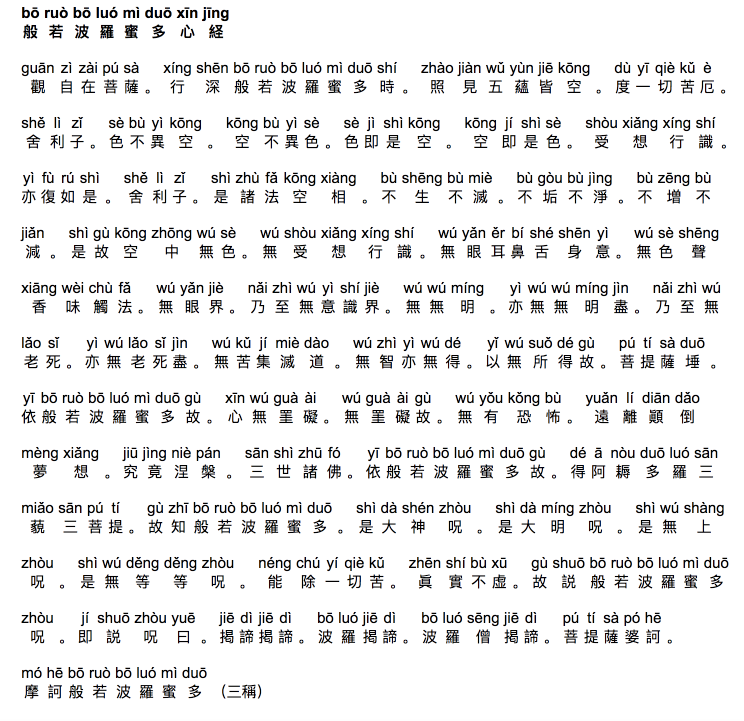

# Mahayana Buddhist Sutras (佛教念诵合集)
This repository contains 17 Mahayana Buddhist Sutras with Pinyin in Plain Text Format (available in Simplified Chinese and Traditional Chinese):

* 净口业真言 (Jing Kou Ye Zhen Yan)
* 大悲咒 (Da Bei Zhou)
* 心经 (Xin Jing)
* 礼佛大忏悔文 (Li Fo Da Chan Hui Wen)
* 准提神咒 (Zhun Ti Shen Zhou)
* 解结咒 (Jie Jie Zhou)
* 往生咒 (Wang Sheng Zhou)
* 消灾吉祥神咒 (Xiao Zai Ji Xiang Shen Zhou)
* 大吉祥天女咒 (Da Ji Xiang Tian Nv Zhou)
* 功德宝山神咒 (Gong De Bao Shan Shen Zhou)
* 七佛灭罪真言 (Qi Fo Mie Zui Zhen Yan)
* 如意宝轮王陀罗尼 (Ru Yi Bao Lun Wang Tuo Luo Ni)
* 圣无量寿决定光明王陀罗尼 (Sheng Wu Liang Shou Jue Ding Guang Ming Wang Tuo Luo Ni)
* 六字真言 (Liu Zi Zhen Yan)
* 补阙真言 (Bu Que Zhen Yan)
* 观音灵感真言 (Kuan Yin Ling Kan Chen Yan)
* 药师灌顶真言 (Yao Shi Guan Ding Zhen Yan)

*Chanting Practice Audios are also available for selected sutras*

Thanks with metta
🙏🙏🙏

<hr>

## HTML Version CSS Formatting
The HTML versions will include the Pinyin and Chinese Characters properly formatted in blocks. This makes reading easier. The following HTML and CSS codes are required:

```
<!DOCTYPE html>
<html>
<head>
<style>

p .srow { display: block; }
p .sblock { float: left; margin: 0 3px; display: block; }
p .pinyin { font-family: Arial; text-align: center; display: block; }
p .char { font-family: Arial; text-align: center; display: block; }

p .padd { font-family: Arial; text-align: center; display: block; }
.title span { font-weight: bold; }

body {
	padding: 0 20px;
	font-family: "Arial";
}

p {
	font-size: 20px;
	text-align: center;
	margin: 0 0 0 0;
	padding: 0;
}

.clearfix:before, .clearfix:after { content: "\0020"; display: block; height: 0; visibility: hidden; }
.clearfix { zoom: 1; }
.clearfix:after { clear: both; }
* html .clearfix { zoom: 1; }

</style>
</head>
<body>

...

</body>
</html>
```

|  | 
|:--:| 
| *Screenshot showing Heart Sutra HTML output example - Paragraph scales to the browser full-width* |

##  Text File Format Description
Each text file contains multiple lines (Pinyin line and Chinese character line). First two lines in the text file are the buddhist sutra title. Pinyin for each Chinese character are separated from each other with a whitespace.

Symbols in the Chinese character line also appears in the Pinyin line.

##  Special Care
Please note that "口弥" (mī) found in some sutras (namely 六字真言 and 观音灵感真言), is considered 1 Chinese character. Under this condition, the Chinese characters are separated with whitespace so you can parse them properly. Same for the character "口栗" (lì) found in 千手千眼无碍大悲心陀罗尼 sutra (Simplified Chinese Version).

> lìu zì zhēn yán (Pinyin line)
>
> 六 字 真 言 (Chinese character line)
>
> 
> ōng mā ní bā mī hòng。(Pinyin line)
>
> 唵 嘛 呢 叭 口弥 吽。(Chinese character line)

##  Recitation Introduction
This repository contains a collection of Buddhist Sutras and Mantras chanted by **Guan Yin Citta Dharma Door (观世音菩萨心灵法门 - Guan Shi Yin Pu Sa Xin Ling Fa Men)** followers. Guan Yin Citta Dharma Door belongs to the Mahayana Buddhist Tradition.

It encourages people to *recite Buddhist scriptures, practise life liberation and make great vows to help more people*.

For more information, please visit <a href="http://www.guanyincitta.info">www.guanyincitta.info</a>.

If any discrepancies are found, please follow the latest version available at <a href="http://lujunhong2or.com">http://lujunhong2or.com</a>.
